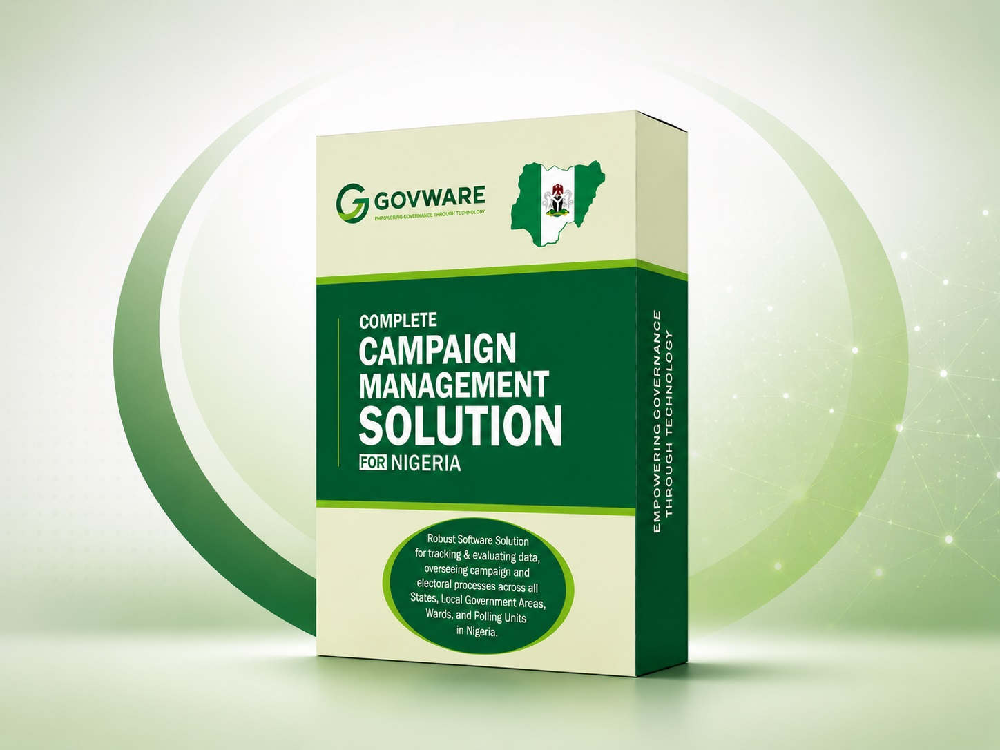

# Political Campaign & Election Management Solution

**Campaign Manager** is a complete political campaign organisation, mobilisation and election-day management platform.

<p>
  <a href="https://github.com/joshualion/Campaign-Manager/releases/latest">
    
  </a>

  <a href="https://github.com/joshualion/Campaign-Manager/releases">
    
  </a>

  

  
</p>

<p>
  <a href="https://github.com/joshualion/Campaign-Manager/releases/latest">
    
  </a>

  <a href="https://github.com/joshualion/Campaign-Manager/releases/latest/download/campaign-manager.zip">
    
  </a>

  <a href="https://www.campaignmanager.ng">
    
  </a>

 <a href="https://www.campaignmanager.ng/order/campaign-manager?deployment=managed">
  
</a>
</p>

<br clear="right">

---



## About Campaign Manager

Campaign Manager is a web-based political campaign and election management solution designed to help campaign organisations coordinate structures, supporters, field teams and election-day operations from one central platform.

The **Community / Self-Hosted Edition is free to download and use** on your own infrastructure.

No software licence or activation key is required to operate the Community Edition.

Govware Solutions also provides optional paid services including:

* QuickStart Geography Provisioning
* Professional Installation
* Migration and Upgrade Assistance
* Priority Technical Support
* Custom Development and Integration
* Managed Deployment
* Campaign SMS services

## Key Features

Campaign Manager includes tools for:

* Campaign structure and geography management
* Supporter and member management
* Campaign dashboards
* Political structure coordination
* Polling-unit and field-agent management
* Notices and announcements
* Internal messaging and notifications
* Election monitoring and reporting
* Campaign scope configuration
* Manual geography setup
* Optional QuickStart Geography Provisioning
* Optional Campaign SMS integration

## Download

Download the latest stable Campaign Manager release from the **Releases** section of this repository.

[View Latest Releases](https://github.com/joshualion/Campaign-Manager/releases)

The official release package is provided as:

```text
campaign-manager.zip
```

The package includes the production dependencies and compiled application assets required for deployment.

## Installation Overview

Campaign Manager is a Laravel-based application and should be deployed on a properly configured PHP web server.

### 1. Download the latest release

Download:

```text
campaign-manager.zip
```

from the latest GitHub Release.

### 2. Upload and extract

Upload the ZIP package to your hosting/server and extract it into the intended application directory.

For a typical hosting environment, keep the Laravel application outside the publicly accessible web root where possible and point the website document root to the application's:

```text
/public
```

directory.

### 3. Configure your environment

Create your application environment configuration from:

```text
.env.example
```

and provide the required database, application URL, mail and other environment settings.

Where command-line access is available:

```bash
cp .env.example .env
php artisan key:generate
```

### 4. Set Laravel permissions

Ensure the web server can write to:

```text
storage/
bootstrap/cache/
```

### 5. Open the installer

Visit your Campaign Manager installation URL:

```text
https://your-domain.com/install
```

The installer will guide you through:

1. System requirements
2. Environment configuration
3. Database setup
4. Mail/storage setup
5. Campaign Scope
6. Relevant campaign geography
7. Campaign Identity
8. Geography setup method
9. Super Administrator setup
10. Final installation

## Campaign Scope

During installation, Campaign Manager can be configured for supported campaign scopes including:

* Presidential / National
* Governorship / State
* Senatorial
* Federal Constituency
* Local Government / Chairmanship

The installer automatically adjusts the required geography information based on the selected campaign scope.

## Geography Setup

Campaign Manager provides two geography setup options.

### Manual Geography Configuration — Free

You can configure and manage your campaign geography manually without purchasing any additional service.

### QuickStart Geography Provisioning — Optional

QuickStart automatically provisions supported electoral geography for your selected campaign.

If you select QuickStart during installation, Campaign Manager will guide you to obtain a **QuickStart Geography Provisioning Key** from the Campaign Manager Portal.

QuickStart is a convenience service and is **not a software licence**.

[Visit Campaign Manager](https://www.campaignmanager.ng)

## Professional Installation

Prefer not to handle deployment yourself?

Govware Solutions can professionally install and configure Campaign Manager on your infrastructure.

Professional Installation is a one-time technical service. After installation and verification, your team can continue managing the deployment independently.

[Get Professional Installation](https://www.campaignmanager.ng)

## Managed Deployment

For campaigns that want Govware Solutions to manage the technical environment throughout the campaign or election cycle, Managed Deployment is available.

Managed Deployment may include:

* Infrastructure planning
* Application deployment
* Domain and SSL configuration
* Database and queue configuration
* Security hardening
* Backups
* Monitoring
* Application updates
* Technical support
* Campaign configuration
* Ongoing election-cycle maintenance

Infrastructure and applicable third-party service costs are funded by the client.

[Learn About Managed Deployment](https://www.campaignmanager.ng)

## Campaign SMS

Campaign Manager supports an optional managed SMS service.

SMS activation and credits are provided separately through Campaign Manager. Upstream provider credentials are not required or exposed to Community users.

## Updates

New versions are published through **GitHub Releases**.

Each release is versioned so existing deployments can identify the version they are running and upgrade when appropriate.

Previous releases may remain available for rollback and compatibility purposes.

## Support

For installation assistance, QuickStart provisioning, technical support, customisation or Managed Deployment:

**Website:** [www.campaignmanager.ng](https://www.campaignmanager.ng)

## Development & Distribution

The public repository is used for Campaign Manager Community documentation and official release distribution.

The production-ready application package is distributed through GitHub Releases as:

```text
campaign-manager.zip
```

## Licence

Campaign Manager Community Edition is free to download and use.

The final open-source/public redistribution licence and associated terms will be published in this repository before the first production public release.

---

<div align="center">

## ❤️ Support Campaign Manager Development

Campaign Manager is free to download and use. If the project is useful to you or your organisation, you can help support continued development, maintenance, testing, security improvements and documentation.

<a href="https://www.campaignmanager.ng/support-development">
  
</a>

**$20 · $50 · $100 · $500 · Custom**

<sub>Support is voluntary and does not purchase a software licence, campaign service, political influence or preferential treatment.</sub>

</div>

---

<div align="center">

**Campaign Manager**

Political Campaign Technology 

[www.campaignmanager.ng](https://www.campaignmanager.ng)

</div>
